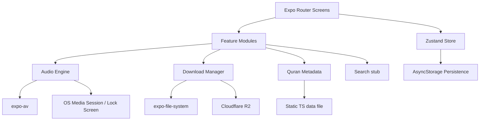

# Design Document — Qur'an Tafsir App

## Overview

A production-grade Qur'an mobile application (Android + iOS) built with React Native and Expo Router. The app delivers page-by-page tafsir audio in Afaan Oromo by Sheikh Jeylan across all 604 Qur'an pages. The binary stays under 30MB by hosting all audio on Cloudflare R2; only 3 sample pages are bundled. Users can stream HQ audio online, download LQ audio for offline use, or listen to bundled samples immediately after install.

The architecture is organized around five Zustand store slices (audio, download, navigation, preferences, bookmarks), a single `resolveAudioSource` function for audio routing, and Expo Router file-based navigation. The design is intentionally extensible to support tafsir text, Qur'an recitation audio, and full-text search without refactoring existing modules.

---

## Architecture



Key design decisions:

- **Zustand slices** are composed into a single store via `create` with `immer` middleware for ergonomic updates.
- **Audio source resolution** is a pure function — no side effects, easy to test.
- **Download concurrency** is managed by a queue processor that maintains at most 3 active `expo-file-system` download resumables.
- **Expo Router** file-based routing maps directly to the navigation structure; no manual navigator wiring needed.
- **i18n** uses a simple key-value map per locale loaded at startup; RTL is toggled via `I18nManager` when Arabic is selected.

---

## Folder Structure

```
quran-tafsir-app/
├── app/                              # Expo Router screens & layouts
│   ├── _layout.tsx                   # Root layout (fonts, store init, i18n)
│   ├── (tabs)/
│   │   ├── _layout.tsx               # Tab bar layout (5 tabs)
│   │   ├── index.tsx                 # Home screen (last-read resume)
│   │   ├── juz.tsx                   # Juz browser
│   │   ├── surah.tsx                 # Surah browser
│   │   ├── search.tsx                # Search screen
│   │   └── settings.tsx              # Settings screen
│   ├── page/
│   │   └── [pageNumber].tsx          # Page screen (dynamic route)
│   ├── bookmarks.tsx                 # Bookmarks list screen
│   └── downloads.tsx                 # Downloads management screen
│
├── src/
│   ├── components/                   # Shared UI components
│   │   ├── AudioPlayer.tsx
│   │   ├── PageHeader.tsx
│   │   ├── MushafText.tsx
│   │   ├── MushafImage.tsx
│   │   ├── DownloadButton.tsx
│   │   ├── OfflineBanner.tsx
│   │   ├── SleepTimerModal.tsx
│   │   ├── SpeedPickerSheet.tsx
│   │   ├── BookmarkModal.tsx
│   │   └── ThemedView.tsx
│   │
│   ├── features/
│   │   ├── audio/
│   │   │   ├── audioEngine.ts        # expo-av wrapper, resolveAudioSource
│   │   │   ├── lockScreen.ts         # OS media session registration
│   │   │   └── index.ts
│   │   ├── download/
│   │   │   ├── downloadManager.ts    # Queue, concurrency, FileSystem ops
│   │   │   ├── storageKeys.ts        # AsyncStorage key constants
│   │   │   └── index.ts
│   │   ├── quran/
│   │   │   ├── metadata.ts           # Static data + lookup helpers
│   │   │   ├── data/
│   │   │   │   └── pages.ts          # 604-entry array (generated from CSV)
│   │   │   └── index.ts
│   │   └── search/
│   │       ├── index.ts              # Stub — search interface defined here
│   │       └── README.md             # Describes future full-text search API
│   │
│   ├── store/
│   │   ├── index.ts                  # Composes all slices into one store
│   │   ├── audioSlice.ts
│   │   ├── downloadSlice.ts
│   │   ├── navigationSlice.ts
│   │   ├── preferencesSlice.ts
│   │   └── bookmarksSlice.ts
│   │
│   ├── hooks/
│   │   ├── useAudioEngine.ts
│   │   ├── useDownloadManager.ts
│   │   ├── useNetworkState.ts
│   │   ├── usePageMetadata.ts
│   │   └── useTheme.ts
│   │
│   ├── constants/
│   │   ├── config.ts                 # R2 base URL, sample pages list
│   │   ├── theme.ts                  # Color palettes, typography, spacing
│   │   └── i18n/
│   │       ├── index.ts              # Locale loader
│   │       ├── om.ts                 # Afaan Oromo (default)
│   │       ├── en.ts                 # English
│   │       └── ar.ts                 # Arabic
│   │
│   └── types/
│       ├── quran.ts                  # PageMetadata, SurahInfo, JuzInfo
│       ├── audio.ts                  # AudioState, AudioSource
│       ├── download.ts               # DownloadState, DownloadItem
│       ├── preferences.ts            # UserPreferences
│       └── bookmarks.ts              # Bookmark
│
└── assets/
    ├── audio/
    │   └── samples/
    │       ├── 1.mp3
    │       ├── 2.mp3
    │       └── 604.mp3
    ├── fonts/
    │   └── KFGQPCUthmanicScript.ttf
    └── pages/                        # Mushaf scanned images (optional, 1-604)
        └── .gitkeep
```

---

## Data Models

```typescript
// src/types/quran.ts

export interface PageMetadata {
  pageNumber: number;           // 1–604
  juzNumber: number;            // 1–30
  surahNumber: number;          // 1–114
  surahNameArabic: string;
  surahNameEnglish: string;
  startAyah: number;
  endAyah: number;
  isFirstPageOfSurah: boolean;
  hasBasmala: boolean;          // false for Surah 9 first page
}

export interface SurahInfo {
  surahNumber: number;          // 1–114
  nameArabic: string;
  nameEnglish: string;
  totalAyahs: number;
  startPage: number;
}

export interface JuzInfo {
  juzNumber: number;            // 1–30
  startPage: number;
  startSurahNameArabic: string;
  startSurahNameEnglish: string;
}

// Extended page data — includes optional future fields (Req 13)
export interface PageData extends PageMetadata {
  tafsirText?: string;
  recitationAudioUrl?: string;
  bookmarkId?: string | null;
}
```

```typescript
// src/types/audio.ts

export type AudioSourceType = 'bundled' | 'local' | 'remote';

export interface AudioSource {
  type: AudioSourceType;
  uri: string | number;         // number for require() bundled assets
  isSample: boolean;
}

export interface AudioState {
  pageNumber: number | null;
  isPlaying: boolean;
  isLoading: boolean;
  positionMs: number;
  durationMs: number;
  playbackSpeed: 0.75 | 1.0 | 1.25 | 1.5 | 2.0;
  isRepeat: boolean;
  sleepTimerMs: number | null;  // null = no timer
  source: AudioSource | null;
  error: string | null;
}
```

```typescript
// src/types/download.ts

export type DownloadStatus = 'queued' | 'downloading' | 'paused' | 'completed' | 'error';

export interface DownloadItem {
  pageNumber: number;
  status: DownloadStatus;
  progress: number;             // 0–1
  error: string | null;
  resumable?: object;           // expo-file-system DownloadResumable handle
}

export interface DownloadState {
  downloadedPages: Set<number>;
  queue: DownloadItem[];
  activeCount: number;          // max 3
  wifiOnly: boolean;
}
```

```typescript
// src/types/preferences.ts

export type ReadingTheme = 'light' | 'dark' | 'sepia' | 'paper';
export type UILanguage = 'om' | 'en' | 'ar';
export type PlaybackSpeed = 0.75 | 1.0 | 1.25 | 1.5 | 2.0;

export interface UserPreferences {
  theme: ReadingTheme;
  fontSize: number;             // 16–36, step 2
  mushafImageMode: boolean;
  autoAdvance: boolean;
  playbackSpeed: PlaybackSpeed;
  uiLanguage: UILanguage;
  wifiOnlyDownload: boolean;
  lastReadPage?: number;
}
```

```typescript
// src/types/bookmarks.ts

export interface Bookmark {
  id: string;                   // uuid
  pageNumber: number;
  surahNameEnglish: string;
  juzNumber: number;
  label: string;                // max 60 chars, may be empty
  createdAt: number;            // Unix timestamp ms
}
```

---

## Zustand Store Architecture

All slices are composed in `src/store/index.ts` using Zustand's `create` with `immer` middleware and `persist` middleware (AsyncStorage adapter) for slices that need persistence.

```typescript
// src/store/index.ts  (sketch)
import { create } from 'zustand';
import { immer } from 'zustand/middleware/immer';
import { persist, createJSONStorage } from 'zustand/middleware';
import AsyncStorage from '@react-native-async-storage/async-storage';

export const useStore = create<AppStore>()(
  immer(
    persist(
      (...a) => ({
        ...createAudioSlice(...a),
        ...createDownloadSlice(...a),
        ...createNavigationSlice(...a),
        ...createPreferencesSlice(...a),
        ...createBookmarksSlice(...a),
      }),
      {
        name: 'quran-tafsir-store',
        storage: createJSONStorage(() => AsyncStorage),
        partialize: (state) => ({
          // Only persist non-ephemeral state
          preferences: state.preferences,
          downloadedPages: [...state.downloadedPages],
          bookmarks: state.bookmarks,
        }),
      }
    )
  )
);
```

### Audio Slice (`src/store/audioSlice.ts`)

```typescript
interface AudioSlice {
  audio: AudioState;
  setAudioPage: (pageNumber: number) => void;
  setPlaying: (isPlaying: boolean) => void;
  setPosition: (positionMs: number) => void;
  setDuration: (durationMs: number) => void;
  setPlaybackSpeed: (speed: PlaybackSpeed) => void;
  toggleRepeat: () => void;
  setSleepTimer: (ms: number | null) => void;
  setAudioError: (error: string | null) => void;
  resetAudio: () => void;
}
```

### Download Slice (`src/store/downloadSlice.ts`)

```typescript
interface DownloadSlice {
  downloadedPages: Set<number>;
  queue: DownloadItem[];
  activeCount: number;
  enqueueDownload: (pageNumber: number) => void;
  enqueueJuz: (juzNumber: number) => void;
  enqueueAll: () => void;
  cancelDownload: (pageNumber: number) => void;
  pauseQueue: () => void;
  resumeQueue: () => void;
  markDownloaded: (pageNumber: number) => void;
  markMissing: (pageNumber: number) => void;
  updateProgress: (pageNumber: number, progress: number) => void;
}
```

### Navigation Slice (`src/store/navigationSlice.ts`)

```typescript
interface NavigationSlice {
  currentPage: number;
  isPageLocked: boolean;
  isFullScreen: boolean;
  setCurrentPage: (page: number) => void;
  togglePageLock: () => void;
  toggleFullScreen: () => void;
}
```

### Preferences Slice (`src/store/preferencesSlice.ts`)

```typescript
interface PreferencesSlice {
  preferences: UserPreferences;
  setTheme: (theme: ReadingTheme) => void;
  setFontSize: (size: number) => void;
  setMushafImageMode: (enabled: boolean) => void;
  setAutoAdvance: (enabled: boolean) => void;
  setPlaybackSpeed: (speed: PlaybackSpeed) => void;
  setUILanguage: (lang: UILanguage) => void;
  setWifiOnlyDownload: (enabled: boolean) => void;
  setLastReadPage: (page: number) => void;
}
```

### Bookmarks Slice (`src/store/bookmarksSlice.ts`)

```typescript
interface BookmarksSlice {
  bookmarks: Bookmark[];
  addBookmark: (pageNumber: number, label: string) => void;
  removeBookmark: (id: string) => void;
  isBookmarked: (pageNumber: number) => boolean;
}
```

---

## Audio Engine Design

### `resolveAudioSource(pageNumber: number): AudioSource`

This pure function is the single point of audio source resolution (Req 9.4). It is defined in `src/features/audio/audioEngine.ts`.

```typescript
const SAMPLE_PAGES = [1, 2, 604] as const;

const BUNDLED_ASSETS: Record<number, number> = {
  1:   require('../../../assets/audio/samples/1.mp3'),
  2:   require('../../../assets/audio/samples/2.mp3'),
  604: require('../../../assets/audio/samples/604.mp3'),
};

export function resolveAudioSource(
  pageNumber: number,
  downloadedPages: Set<number>,
  baseUrl: string,
): AudioSource {
  // Priority 1: bundled sample
  if (SAMPLE_PAGES.includes(pageNumber as any)) {
    return { type: 'bundled', uri: BUNDLED_ASSETS[pageNumber], isSample: true };
  }
  // Priority 2: locally downloaded LQ file
  if (downloadedPages.has(pageNumber)) {
    const uri = `${FileSystem.documentDirectory}audio/lq/${pageNumber}.mp3`;
    return { type: 'local', uri, isSample: false };
  }
  // Priority 3: remote HQ stream
  return { type: 'remote', uri: `${baseUrl}/hq/${pageNumber}.mp3`, isSample: false };
}
```

### expo-av Integration

`useAudioEngine.ts` manages the `Audio.Sound` lifecycle:

```typescript
// Simplified lifecycle
const sound = useRef<Audio.Sound | null>(null);

async function loadPage(pageNumber: number) {
  await sound.current?.unloadAsync();           // release previous
  const source = resolveAudioSource(pageNumber, downloadedPages, BASE_URL);
  const { sound: s } = await Audio.Sound.createAsync(
    source.type === 'bundled' ? source.uri : { uri: source.uri as string },
    { shouldPlay: false, rate: preferences.playbackSpeed, progressUpdateIntervalMillis: 500 },
    onPlaybackStatusUpdate,
  );
  sound.current = s;
}
```

### Background Audio & Lock Screen (`src/features/audio/lockScreen.ts`)

```typescript
// Called once at app startup in app/_layout.tsx
await Audio.setAudioModeAsync({
  staysActiveInBackground: true,
  playsInSilentModeIOS: true,
  interruptionModeIOS: InterruptionModeIOS.DoNotMix,
  interruptionModeAndroid: InterruptionModeAndroid.DoNotMix,
});
```

Lock screen controls are registered via `expo-av`'s `Audio.Sound` combined with the `react-native-track-player` or the native media session. Since Expo AV handles background mode, lock screen metadata (title = surah name + page number, artist = "Sheikh Jeylan") is set via `Audio.Sound`'s `updateAsync` with `progressUpdateIntervalMillis` and the `nowPlayingInfo` option available in Expo SDK 50+. Next/previous actions dispatch to the navigation slice.

---

## Download Manager Design

### Queue Processor (`src/features/download/downloadManager.ts`)

The download manager runs a queue processor that keeps at most `MAX_CONCURRENT = 3` active downloads.

```typescript
export async function processQueue(
  queue: DownloadItem[],
  dispatch: DownloadDispatch,
  wifiOnly: boolean,
  isConnected: boolean,
  isWifi: boolean,
): Promise<void> {
  if (wifiOnly && !isWifi) return;
  if (!isConnected) return;

  const active = queue.filter(i => i.status === 'downloading');
  const queued = queue.filter(i => i.status === 'queued');
  const slots = MAX_CONCURRENT - active.length;

  for (const item of queued.slice(0, slots)) {
    startDownload(item.pageNumber, dispatch);
  }
}

async function startDownload(pageNumber: number, dispatch: DownloadDispatch) {
  const url = `${BASE_URL}/lq/${pageNumber}.mp3`;
  const dest = `${FileSystem.documentDirectory}audio/lq/${pageNumber}.mp3`;

  await FileSystem.makeDirectoryAsync(
    `${FileSystem.documentDirectory}audio/lq/`,
    { intermediates: true }
  );

  const resumable = FileSystem.createDownloadResumable(
    url, dest, {},
    ({ totalBytesWritten, totalBytesExpectedToWrite }) => {
      dispatch.updateProgress(pageNumber, totalBytesWritten / totalBytesExpectedToWrite);
    }
  );

  dispatch.setStatus(pageNumber, 'downloading');
  const result = await resumable.downloadAsync();
  if (result?.status === 200) {
    dispatch.markDownloaded(pageNumber);
  } else {
    dispatch.setError(pageNumber, 'Download failed');
  }
}
```

### File System Paths

| Purpose | Path |
|---|---|
| Downloaded LQ audio | `{documentDirectory}/audio/lq/{pageNumber}.mp3` |
| AsyncStorage — downloaded pages | `@quran/downloadedPages` |
| AsyncStorage — user preferences | `@quran/preferences` |
| AsyncStorage — bookmarks | `@quran/bookmarks` |
| AsyncStorage — last read page | embedded in preferences |

### Integrity Check

On app launch, `downloadManager.ts` verifies that each page number in `downloadedPages` has a corresponding file via `FileSystem.getInfoAsync`. Missing files are removed from the set (Req 10.10, 11.4).

---

## Navigation Structure

Expo Router file-based routing. All navigation to the Page Screen uses `router.push('/page/[pageNumber]')`.

```
app/
  _layout.tsx              → Root Stack (fonts loaded, store hydrated)
  (tabs)/
    _layout.tsx            → Bottom tab bar: Home | Juz | Surah | Search | Settings
    index.tsx              → Home (last-read resume card)
    juz.tsx                → Juz list (30 entries + bulk download button)
    surah.tsx              → Surah list (114 entries + search placeholder)
    search.tsx             → Search screen
    settings.tsx           → Settings
  page/
    [pageNumber].tsx       → Page Screen (dynamic, shared by all nav paths)
  bookmarks.tsx            → Bookmarks list (pushed from Settings or header icon)
  downloads.tsx            → Downloads screen (pushed from Settings)
```

### Tab Bar (5 tabs)

| Tab | Icon | Screen |
|---|---|---|
| Home | house | `(tabs)/index.tsx` |
| Juz | grid | `(tabs)/juz.tsx` |
| Surah | list | `(tabs)/surah.tsx` |
| Search | magnifier | `(tabs)/search.tsx` |
| Settings | gear | `(tabs)/settings.tsx` |

### Page Screen Route

`app/page/[pageNumber].tsx` receives `pageNumber` as a route param. On mount it:
1. Calls `setCurrentPage(pageNumber)` on the navigation slice.
2. Calls `setLastReadPage(pageNumber)` on the preferences slice (debounced 1s).
3. Calls `loadPage(pageNumber)` on the audio engine.

Swipe gestures are handled by a `PanResponder` (or `react-native-gesture-handler` `GestureDetector`) wrapping the page content. Left swipe → next page, right swipe → previous page, with bounce-back at boundaries.

---

## Component Tree

### `AudioPlayer` (`src/components/AudioPlayer.tsx`)

```typescript
interface AudioPlayerProps {
  pageNumber: number;
  isSample: boolean;
}
```

Renders: play/pause button, seek bar (Slider), elapsed/total time, speed button, repeat toggle, sleep timer button, download button. Reads from `useStore(s => s.audio)`.

### `MushafText` (`src/components/MushafText.tsx`)

```typescript
interface MushafTextProps {
  pageNumber: number;
  fontSize: number;
  theme: ReadingTheme;
}
```

Renders the Tajweed-colored Arabic text for the page. Text data comes from the static `pages.ts` data file. Uses `Text` with inline color styles per character group.

### `MushafImage` (`src/components/MushafImage.tsx`)

```typescript
interface MushafImageProps {
  pageNumber: number;
  onFallback: () => void;   // called if image not found
}
```

Renders `<Image source={require(`../../../assets/pages/${pageNumber}.png`)} />` with `resizeMode="contain"`. Calls `onFallback` on error.

### `DownloadButton` (`src/components/DownloadButton.tsx`)

```typescript
interface DownloadButtonProps {
  pageNumber: number;
}
```

Reads download state from store. Shows: download icon (not downloaded), progress ring (downloading), checkmark (downloaded), or error icon with retry.

### `OfflineBanner` (`src/components/OfflineBanner.tsx`)

Reads `useNetworkState()`. Renders a persistent banner when offline. No props.

### `PageHeader` (`src/components/PageHeader.tsx`)

```typescript
interface PageHeaderProps {
  pageNumber: number;
  isFullScreen: boolean;
  isPageLocked: boolean;
  onToggleFullScreen: () => void;
  onTogglePageLock: () => void;
  onBookmark: () => void;
}
```

### `SpeedPickerSheet` (`src/components/SpeedPickerSheet.tsx`)

```typescript
interface SpeedPickerSheetProps {
  currentSpeed: PlaybackSpeed;
  onSelect: (speed: PlaybackSpeed) => void;
  onClose: () => void;
}
```

### `SleepTimerModal` (`src/components/SleepTimerModal.tsx`)

```typescript
interface SleepTimerModalProps {
  onSelect: (minutes: number | 'end-of-page') => void;
  onCancel: () => void;
  onClose: () => void;
}
```

---

## Remote Storage Integration

### `src/constants/config.ts`

```typescript
// Single source of truth for R2 configuration (Req 9.5)
export const R2_BASE_URL = process.env.EXPO_PUBLIC_R2_BASE_URL ?? '';

export const SAMPLE_PAGES = [1, 2, 604] as const;
export type SamplePage = typeof SAMPLE_PAGES[number];

export function buildLqUrl(pageNumber: number): string {
  return `${R2_BASE_URL}/lq/${pageNumber}.mp3`;
}

export function buildHqUrl(pageNumber: number): string {
  return `${R2_BASE_URL}/hq/${pageNumber}.mp3`;
}

export const MAX_CONCURRENT_DOWNLOADS = 3;
export const MAX_BOOKMARKS = 200;
export const LAST_READ_SAVE_DEBOUNCE_MS = 1000;
export const AUTO_ADVANCE_DELAY_MS = 1000;
export const FULL_SCREEN_CONTROLS_TIMEOUT_MS = 3000;
```

The `EXPO_PUBLIC_R2_BASE_URL` environment variable is set in `.env` and `.env.production`. When empty, `resolveAudioSource` returns `null` for non-sample pages and the `AudioPlayer` renders the "Audio coming soon" placeholder (Req 9.6).

---

## Localization Architecture

### `src/constants/i18n/index.ts`

```typescript
import om from './om';
import en from './en';
import ar from './ar';

export type TranslationKey = keyof typeof en;
export type Locale = 'om' | 'en' | 'ar';

const translations: Record<Locale, typeof en> = { om, en, ar };

export function t(key: TranslationKey, locale: Locale): string {
  return translations[locale][key] ?? translations['en'][key] ?? key;
}
```

Each locale file (`om.ts`, `en.ts`, `ar.ts`) exports a flat `Record<string, string>` object. All UI strings are keys in this object — screen titles, button labels, error messages, prompts.

RTL support: when `uiLanguage === 'ar'`, the root layout calls `I18nManager.forceRTL(true)` and triggers an app reload (standard React Native RTL pattern).

### Sample keys

```typescript
// en.ts
export default {
  home_resume_prompt: 'Resume from page {{page}}',
  home_resume_button: 'Resume',
  audio_coming_soon: 'Audio coming soon',
  offline_banner: 'You are offline',
  download_button: 'Download for offline',
  // ... 100+ keys
} as const;
```

---

## Extensibility Points

### Tafsir Text (future)

`PageData.tafsirText?: string` is already defined. The `MushafText` component accepts an optional `tafsirText` prop that renders a collapsible panel below the Arabic text when present. The `quran/data/pages.ts` file can be regenerated from the CSV pipeline to include tafsir text without touching any other file.

### Recitation Audio (future)

`PageData.recitationAudioUrl?: string` is already defined. The audio engine's `resolveAudioSource` can be extended with a `mode: 'tafsir' | 'recitation'` parameter. The `AudioPlayer` component can render a mode toggle. No existing interfaces need to change.

### Full-Text Search (future)

`src/features/search/index.ts` exports a stub interface:

```typescript
export interface SearchProvider {
  search(query: string): Promise<SearchResult[]>;
}

export interface SearchResult {
  type: 'surah' | 'page' | 'juz' | 'ayah';
  pageNumber: number;
  label: string;
  snippet?: string;
}

// Current implementation: metadata-only search
// Future: plug in a full-text Arabic ayah index (e.g., Fuse.js or a bundled SQLite DB)
export const defaultSearchProvider: SearchProvider = { ... };
```

The `Search` screen depends only on `SearchProvider`, so swapping in a full-text provider requires no screen changes.

### Additional Reciters (future)

`config.ts` can be extended with a `RECITERS` map. `resolveAudioSource` accepts an optional `reciterId` parameter. The download manager path becomes `audio/lq/{reciterId}/{pageNumber}.mp3`.

---

## Correctness Properties

*A property is a characteristic or behavior that should hold true across all valid executions of a system — essentially, a formal statement about what the system should do. Properties serve as the bridge between human-readable specifications and machine-verifiable correctness guarantees.*

**Property reflection:** After prework analysis, the three audio source resolution properties (9.1, 9.2, 9.3) together cover the complete decision tree of `resolveAudioSource` and can be expressed as one comprehensive property. The metadata field-validity property (2.2) and the lookup correctness property (2.3) are distinct — one checks structure, the other checks identity — so both are kept. The bookmark add/remove round-trips (26.2–26.3) are complementary and kept as one combined property. All remaining properties are unique.

---

### Property 1: Metadata completeness and validity

*For any* page number `n` in the range 1–604, `getPageMetadata(n)` SHALL return an entry where `pageNumber === n`, `juzNumber` is in [1, 30], `surahNumber` is in [1, 114], `startAyah >= 1`, `endAyah >= startAyah`, and both `surahNameArabic` and `surahNameEnglish` are non-empty strings.

**Validates: Requirements 2.2, 2.3**

---

### Property 2: Juz partition covers all pages

*For any* juz number `j` in [1, 30], every page returned by `getPagesByJuz(j)` SHALL have `juzNumber === j`, and the union of `getPagesByJuz(j)` for all `j` in [1, 30] SHALL contain exactly the 604 distinct page numbers.

**Validates: Requirements 2.4**

---

### Property 3: Audio source resolution is exhaustive and correct

*For any* page number `n` in [1, 604], `resolveAudioSource(n, downloadedPages, baseUrl)` SHALL return exactly one of:
- `{ type: 'bundled', isSample: true }` if `n` is in `SAMPLE_PAGES` (1, 2, 604),
- `{ type: 'local', uri: matching documentDirectory path }` if `n` is not a sample page and `downloadedPages.has(n)` is true,
- `{ type: 'remote', uri: matching HQ URL }` if `n` is not a sample page, not downloaded, and `baseUrl` is non-empty,
- `null` if `n` is not a sample page, not downloaded, and `baseUrl` is empty.

**Validates: Requirements 9.1, 9.2, 9.3, 9.6**

---

### Property 4: Download path correctness

*For any* page number `n` in [1, 604], the computed local file path for that page SHALL equal `{FileSystem.documentDirectory}audio/lq/{n}.mp3` — no other path format is used.

**Validates: Requirements 10.4**

---

### Property 5: Download concurrency invariant

*For any* state of the download queue, the count of items with `status === 'downloading'` SHALL never exceed `MAX_CONCURRENT_DOWNLOADS` (3).

**Validates: Requirements 10.9**

---

### Property 6: Downloaded pages persistence round-trip

*For any* set of page numbers `S`, serializing `S` to AsyncStorage and then deserializing it SHALL produce a set equal to `S` (same elements, no additions or omissions).

**Validates: Requirements 11.1**

---

### Property 7: Playback speed state consistency

*For any* speed value `v` in `{0.75, 1.0, 1.25, 1.5, 2.0}`, calling `setPlaybackSpeed(v)` SHALL result in `store.audio.playbackSpeed === v` immediately after the call.

**Validates: Requirements 21.1**

---

### Property 8: Bookmark add/remove round-trip

*For any* page number `n` in [1, 604]:
- After `addBookmark(n, label)`, `isBookmarked(n)` SHALL return `true` and the bookmarks array SHALL contain exactly one entry with `pageNumber === n`.
- After `removeBookmark(id)` for that bookmark's id, `isBookmarked(n)` SHALL return `false`.

**Validates: Requirements 26.2, 26.3**

---

### Property 9: Bookmark count invariant

*For any* sequence of `addBookmark` calls, `bookmarks.length` SHALL never exceed `MAX_BOOKMARKS` (200). Any attempt to add a bookmark when the limit is reached SHALL leave the bookmarks array unchanged.

**Validates: Requirements 26.9**

---

### Property 10: Surah search completeness

*For any* surah `s` in the 114-surah dataset and any non-empty substring `q` of `s.nameEnglish` or `s.nameArabic`, `searchSurahs(q)` SHALL include `s` in its results.

**Validates: Requirements 27.3**

---

### Property 11: Page number search correctness

*For any* integer `n` in [1, 604], `search(String(n))` SHALL include a result with `type === 'page'` and `pageNumber === n`.

**Validates: Requirements 27.4**

---

## Error Handling

| Scenario | Handling |
|---|---|
| R2 base URL empty | `resolveAudioSource` returns `null`; `AudioPlayer` renders "Audio coming soon" placeholder |
| Network request fails during stream | expo-av emits error status; audio slice sets `error`; player shows retry button |
| Download fails | `DownloadItem.status = 'error'`; error message shown; retry available |
| Mushaf image not found | `MushafImage.onFallback()` called; page falls back to text mode with notice |
| AsyncStorage read fails on launch | App uses default preferences; logs error; does not crash |
| Page number out of range (navigation) | Navigation slice clamps to [1, 604]; validation message shown for manual input |
| Bookmark limit reached (200) | `addBookmark` is a no-op; toast notification shown to user |
| File missing after download recorded | `FileSystem.getInfoAsync` check on access; `markMissing` called; re-download offered |
| Device offline during download | Queue paused; `OfflineBanner` shown; auto-resumed on reconnect |
| Audio interrupted (phone call) | expo-av `InterruptionModeIOS.DoNotMix` / Android equivalent; playback pauses; resumes on user action |

---

## Testing Strategy

### Dual Testing Approach

Unit tests cover specific examples, edge cases, and error conditions. Property-based tests verify universal properties across all inputs. Both are necessary for comprehensive coverage.

### Property-Based Testing Library

**[fast-check](https://github.com/dubzzz/fast-check)** — TypeScript-native, works in Jest/Vitest, no native dependencies, ideal for React Native projects.

Each property test runs a minimum of **100 iterations** (fast-check default). Each test is tagged with a comment referencing the design property.

```typescript
// Feature: quran-tafsir-app, Property 1: Metadata completeness and validity
it.prop([fc.integer({ min: 1, max: 604 })])('metadata is complete for all pages', (n) => {
  const meta = getPageMetadata(n);
  expect(meta.pageNumber).toBe(n);
  expect(meta.juzNumber).toBeGreaterThanOrEqual(1);
  expect(meta.juzNumber).toBeLessThanOrEqual(30);
  // ...
});
```

### Unit Tests

Focus on:
- Specific examples for `resolveAudioSource` (sample page, downloaded page, remote page, empty URL)
- Download path builder with known page numbers
- Bookmark CRUD with concrete data
- Search with known surah names and edge inputs ("", whitespace, numbers at boundaries)
- Preferences serialization/deserialization
- Sleep timer countdown and cancellation logic
- Auto-advance behavior at page 604 boundary

### Integration Tests

- AsyncStorage persistence: write preferences, reload store, verify values restored
- Download manager: enqueue → process → verify file path recorded (mocked FileSystem)
- Audio engine: load page → play → pause → verify state transitions (mocked expo-av)

### What is NOT property-tested

- UI rendering (MushafText, AudioPlayer, theme application) — use snapshot tests
- Lock screen registration — single integration test with mocked expo-av
- Network connectivity detection — example-based tests with mocked NetInfo
- Expo Router navigation — example-based tests with mocked router

### Test File Locations

```
src/
  features/
    quran/__tests__/metadata.test.ts
    audio/__tests__/audioEngine.test.ts
    download/__tests__/downloadManager.test.ts
    search/__tests__/search.test.ts
  store/__tests__/
    audioSlice.test.ts
    downloadSlice.test.ts
    bookmarksSlice.test.ts
    preferencesSlice.test.ts
```
